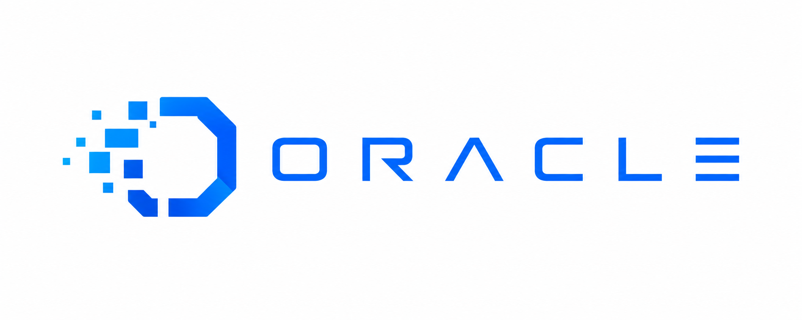

# Oracle

<p align="center">
  
</p>

MCP-powered AI coding consultant with persistent memory, a docs knowledge
base, web access, and GitHub integration.
Ships both a CLI (`oracle`) and an MCP server (`oracle-mcp`) for Claude Code,
opencode, Clew Code, and any MCP-compatible agent.

Requires **Node.js ≥ 24**.

## What it does

Oracle answers questions and reviews code with project context, and remembers
across conversations. It pulls context from four sources — persistent memory
(facts, insights, a compiled wiki), a local docs store (`.oracle/docs/`), the
web, and your project files — then asks a configured provider/model. It can
also read/review GitHub PRs and issues.

**Autonomous agent mode** (`oracle_agent`): Run agentic tasks autonomously with
file system access, shell execution, and **multimodal input** (images, videos).
Apply engineering skills (review, debug, security, architecture, tests) to guide
agent reasoning. Discover and invoke tools from external MCP servers.

**Supported providers:** `codex`, `openai`, `anthropic`, `opencode`

## Install & build

```bash
npm install
npm run build              # tsc -> dist/
node dist/cli.js doctor    # verify provider is wired up
```

Scripts: `build`, `dev` (tsx src/cli.ts), `mcp` (tsx src/mcp.ts),
`typecheck` (tsc --noEmit), `test` (vitest run src).

## CLI usage

```bash
# One-shot questions — Oracle reads your mood and adapts automatically
oracle ask "what does ECONNRESET on a Redis client mean?"
oracle ask "review this for edge cases" -f "src/**/*.ts"
oracle ask "summarise this module" --include-docs

# Or pick a specific personality with --soul
oracle ask "review this code" --soul engineer

oracle doctor
```

> **Auto mood** — When you don't pass `--soul`, Oracle reads your tone from the question
> and freely picks its own personality: playful, serious, sarcastic, gentle, dramatic,
> or whatever fits the moment. It can even shift mid-conversation.

Commands:

| Command | Purpose |
|---|---|
| `ask` | One-shot question; `-f` to include files, `--soul` for specific personality, `--conversation` for continuity, `--include-docs` for local docs. **No `--soul` = Oracle chooses its own mood automatically** |
| `memory` `list\|clear` | Inspect / clear the memory store |
| `wiki` `build\|list\|show` | Compile and browse the memory wiki |
| `docs` `list\|search\|add\|remove` | Manage the local docs knowledge base |
| `web` `search\|fetch\|extract` | Web search (`--provider`, `--trace`), fetch a URL (`--provider`), structured extract (AgentQL) |
| `oracle` `list\|register\|unregister\|show` | Manage oracle profiles |
| `session` `<id>` | Show a past consult session |
| `status` | List recent sessions |
| `skill` `list\|install` | Manage installed skills |
| `github` `check\|pr\|issue\|search\|get` | GitHub PR/issue access |
| `identity` `show\|setup`, `persona`, `forget` | Identity and persona management |
| `login` / `logout` | Anthropic OAuth |
| `doctor` | Check provider wiring |
| `setup-mcp` | Generate MCP client config (`--client claude-code\|codex`) |

## MCP server

Wire `oracle-mcp` (built to `dist/mcp.js`) into your MCP client:

```json
{
  "mcpServers": {
    "oracle": {
      "command": "node",
      "args": ["/absolute/path/to/Oracle/dist/mcp.js"],
      "env": {
        "ORACLE_USE_OLLAMA": "1",
        "ORACLE_WORKSPACE_ROOT": "/absolute/path/to/your/project"
      }
    }
  }
}
```

Or run `oracle setup-mcp` to generate it.

## Smart memory

Oracle's memory system uses ML-inspired algorithms to surface the **most relevant** information automatically.

| Feature | Description |
|---|---|
| **Recency-weighted scoring** | Memories accessed often or recently rank higher — formula: `semantic×0.6 + importance×0.2 + recencyBoost×0.15 + freqBoost×0.05` |
| **Entity knowledge graph** | Extracts entities (technologies, projects, people) from memory content, builds typed relationship edges, and expands search queries with related entities |
| **Auto-consolidation** | Finds similar memories by tag overlap (Jaccard ≥ 0.3) and merges them — reduces clutter without data loss |
| **Access tracking** | Every `recall`/`scored_search` bump increments `accessCount` and updates `lastAccessed` — unused memories decay |
| **Background maintenance** | `prune` removes stale low-value memories (30d untouched + importance < 0.2), `promote` graduates frequently-retrieved working memories into durable `insight` |
| **LLM reflection** | Clusters related memories and asks Claude to synthesize new higher-level insights — requires `ANTHROPIC_API_KEY` + `ORACLE_MEMORY_LLM_GRAPH=1` |

Memory data lives in `.oracle-memory/` — compatible with the standalone `oracle-memory` MCP server.

## MCP tools (41)

**Agent**
`oracle_agent` (supports `skill` parameter: review, debug, security, architecture, tests)

**Ask**
`oracle_ask`

**Memory**
`oracle_memory_list`, `oracle_memory_search`, `oracle_memory_update`,
`oracle_memory_stats`, `oracle_memory_clear`, `oracle_memory_scored_search`

**Entity graph**
`oracle_memory_graph_query`, `oracle_memory_graph_path`,
`oracle_memory_graph_stats`

**Consolidation & maintenance**
`oracle_memory_consolidate`, `oracle_memory_prune`, `oracle_memory_promote`,
`oracle_memory_maintenance`

**Reflection**
`oracle_memory_reflect`

**Memory wiki**
`oracle_memory_wiki_build`, `oracle_memory_wiki_list`, `oracle_memory_wiki_get`

**Docs**
`oracle_docs_list`, `oracle_docs_search`, `oracle_docs_add`, `oracle_docs_remove`

**Web**
`oracle_web_search`, `oracle_web_fetch`, `oracle_web_extract`

**Oracle profiles**
`oracle_oracle_list`, `oracle_oracle_register`

**Identity / persona**
`oracle_identity_show`, `oracle_identity_setup`, `oracle_persona_set`

**Inter-agent messaging** (Oracle as relay between agents)
`oracle_msg_send`, `oracle_msg_inbox`, `oracle_msg_ack`, `oracle_msg_thread`
— all oracle-mcp processes on a machine share `~/.oracle/messages/`, so agents
in different sessions (Claude Code, opencode, etc.) can exchange messages and
broadcasts (`to: "*"`), with per-agent read tracking and threading via `replyTo`.

*Push-on-idle via Claude Code Stop hook:* the bus is pull-based, but
`scripts/oracle-msg-stop-hook.mjs` turns it into push — when Claude finishes
responding, the hook checks this agent's unread messages and, if any exist,
blocks the stop so Claude wakes up, reads the inbox, and acks. Register it in
`.claude/settings.json` (agent name as the argument; the `stop_hook_active`
guard prevents infinite loops):

```json
{
  "hooks": {
    "Stop": [{ "hooks": [{ "type": "command",
      "command": "node /path/to/Oracle/scripts/oracle-msg-stop-hook.mjs my-agent-name" }] }]
  }
}
```

**Sessions / skills / health**
`oracle_sessions`, `oracle_session_get`, `oracle_skills`, `oracle_doctor`

**Agent tools** (autonomous task execution, confined to the workspace — no shell access)
- File operations: `read_file`, `write_file`, `edit_file`, `list_dir`, `glob`
- Search: `grep`
- **Multimodal:** `read_image` (PNG/JPEG/GIF/WebP), `read_video` (MP4/WebM)

## Autonomous Agent

Oracle runs agentic tasks with tool-use loops — the agent autonomously calls
tools, processes results, and iterates toward a goal. Supports multimodal input
(images, videos) when using Claude models.

**Features:**
- **File access:** read/write/edit files, list directories, search with glob/grep — every path is
  resolved against the workspace root and refused if it escapes it; there is no shell tool
- **Audit trail:** all file mutations tracked with content hashes — query `result.audit.getSummary()`
  to see what the agent changed
- **Resource limits:** external MCP tools run with 30s timeout and 100KB output cap to prevent runaway
- **Multimodal input:** agents can read and analyze images/videos from the workspace
- **Skills:** apply engineering best practices (review, debug, security, architecture, tests)
- **MCP integration:** agent discovers and uses tools from external MCP servers with opt-in mutation flag

**Usage:**
```bash
oracle agent "fix the failing tests" --skill debug
```

Or via MCP:
```json
{
  "prompt": "Review this code for security issues",
  "skill": "security"
}
```

## Observability & Logging

Oracle logs structured events as JSON lines to stderr (never stdout, so it doesn't interfere with tool
output or MCP communication). Logs are tagged with `[oracle:*]` for easy grepping and machine parsing.

**Log streams:**
- `[oracle:agent]` — loop lifecycle (start, turns, stop), turn duration, token usage
- `[oracle:tool]` — tool calls (name, turn), results (duration, output size), errors
- `[oracle:mcp]` — MCP server connect/disconnect, tool discovery, tool calls and errors
- `[oracle:sandbox]` — security events (path-escape attempts, mutation denials in read-only mode)

**Example:**
```bash
ORACLE_LOG=1 oracle agent "refactor this" 2>&1 | grep oracle
# [oracle:agent] {"ts":"2026-07-21T12:00:00.000Z","event":"start","model":"claude-sonnet-5",...}
# [oracle:tool] {"ts":"2026-07-21T12:00:00.100Z","event":"call","toolName":"read_file",...}
# [oracle:tool] {"ts":"2026-07-21T12:00:00.102Z","event":"result","durationMs":2,...}
```

Disable with `ORACLE_LOG=0` if you need to suppress logging overhead in production.

## Audit Trail & Safety

Every agent run includes an audit trail tracking file mutations with timestamps and content hashes:

```js
const result = await agent.run({ prompt: "refactor this file" });
const summary = result.audit.getSummary();
console.log(summary);
// {
//   totalChanges: 5,
//   mutations: 2,                    // write, edit only (not reads)
//   byType: { read: 3, write: 1, edit: 1 },
//   filesChanged: [ "src/main.ts", "src/utils.ts" ]
// }

// Access full trail with content hashes for verification
result.audit.getChanges().forEach(c => {
  console.log(`${c.type}: ${c.path} (hash: ${c.contentHash})`);
});
```

**Resource limits for external MCP tools** (safety guardrails):
- 30-second timeout per tool call
- 100KB output cap per call (truncated if exceeded)
- Logged in `[oracle:mcp]` result events as `outputTruncated` flag

## Configuration

Project config lives in `.oracle/config.json`:

```json
{
  "provider": "codex",
  "model": "gpt-5.4-mini",
  "include": ["src/**/*", "README.md", "package.json"],
  "exclude": ["**/*.test.ts", "**/node_modules/**", "**/dist/**"],
  "maxFileSizeBytes": 1000000,
  "maxInputBytes": 5000000,
  "mcpServers": [
    {
      "name": "your-mcp-server",
      "url": "http://localhost:3000",
      "trustedForMutation": false
    }
  ]
}
```

**Config fields:**
- `provider` — `codex`, `openai`, `anthropic`, or `opencode`
- `model` — model ID (e.g., `gpt-5.4-mini`, `claude-sonnet-5`)
- `include` / `exclude` — file patterns for context window
- `mcpServers` — external MCP servers to wire into the agent (stdio or HTTP)
  - `name` — server name (used to prefix tool names as `mcp_<name>_<tool>`)
  - `command` — for stdio servers: executable path (e.g., `"node"`, `"/usr/local/bin/my-mcp-server"`)
  - `args` — stdio server arguments
  - `url` — for HTTP/SSE servers: server endpoint URL
  - `trustedForMutation` — if `true`, the agent can call write/mutating tools from this server; default `false` (read-only)

Environment variables:

| Var | Purpose |
|---|---|
| `ORACLE_WORKSPACE_ROOT` | Project root the MCP server operates on |
| `ORACLE_HOME_DIR` | Override the `~/.oracle` home (sessions, profiles, config) |
| `ORACLE_USE_OLLAMA` | Enable semantic memory search via Ollama embeddings (`"1"` or `"true"`) |
| `ORACLE_MEMORY_BIN` | Path to `oracle-memory` binary (default: `oracle-memory`) |
| `ORACLE_MEMORY_LLM_GRAPH` | Enable LLM-powered entity extraction, conflict detection, and reflection (requires `ANTHROPIC_API_KEY`) |
| `ORACLE_LOG` | Set to `"0"` to disable structured observability logging (`[oracle:*]` JSON lines to stderr) |
| `ORACLE_WEB_LOG` | Set to `"0"` to disable web search/fetch logging |
| `OLLAMA_HOST` | Ollama endpoint (default `http://127.0.0.1:11434`) |
| `OLLAMA_EMBED_MODEL` | Embedding model (default `nomic-embed-text`) |
| `BRAVE_API_KEY` | Brave Search API key |
| `TAVILY_API_KEY` | Tavily Search API key |
| `FIRECRAWL_API_KEY` | Firecrawl API key (JS-rendered page scraping) |
| `AGENTQL_API_KEY` | TinyFish AgentQL key (structured data extraction) |

Provider API keys are read from the environment / `.env` (see `oracle doctor`):

| Provider | Required Env Vars |
|---|---|
| `codex` | Codex CLI installed and authenticated |
| `openai` | `OPENAI_API_KEY`, optionally `OPENAI_API_BASE` |
| `anthropic` | `ANTHROPIC_API_KEY` |
| `opencode` | `OPENCODE_API_KEY` (or `OPENAI_API_KEY`), `OPENCODE_API_BASE`, `OPENCODE_MODEL` |
